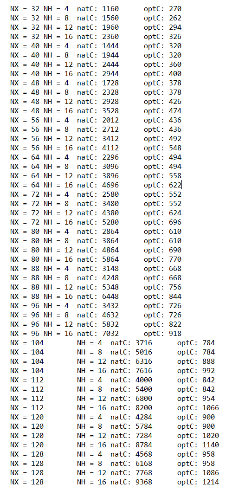
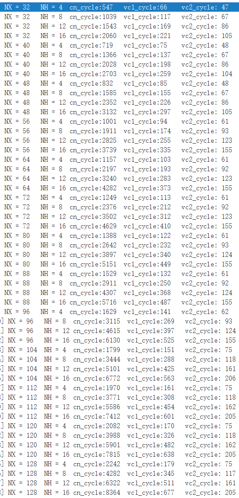
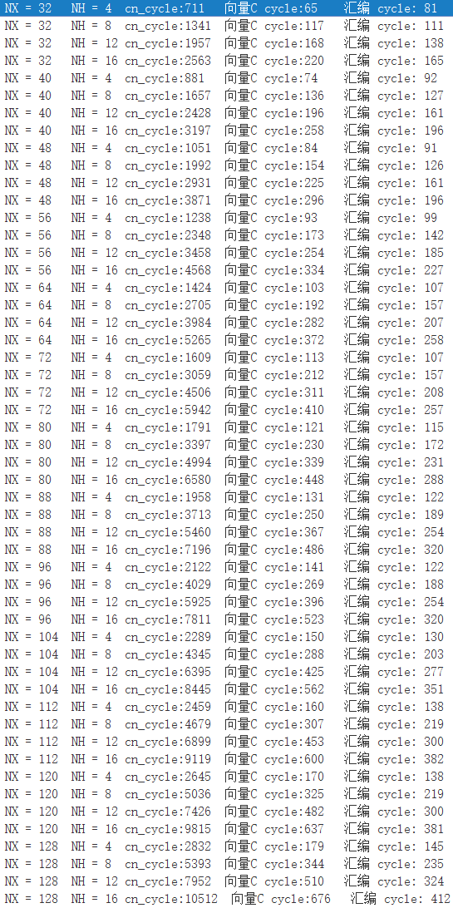

```c

DSPF_sp_fir_gen(
       const float* x,      //输入数组
	   const float* h,  //系数数组
  	   float* r,	    //输出数组
 	   int nh,	    //系数数组长度
	   int nr	    //输出数组长度
	)
```

**计算**：r(n) = h(0)*x(n) + h(1)*x(n−1) + ... + h(nh−1)*x(n−nh+1)   where n = {0, 1, ... , nr−1}
**说明**：Ti中初始化x时前（nh-1）为0，表示计算公式中x的负数索引

**参数要求**：

 * h reverse order   
 * nr >= 4 && nr % 4 = 0
 * nh >=4 && nh % 4 = 0
 * （边界对齐）

**函数性能：**（单位：cycle）

|     规模      | TI优化 | FT向量C | FT线性汇编 | FT汇编 |
| :-----------: | :----: | :-----: | :--------: | :----: |
|  NX=32、NH=4  |  270   |   66    |            |   82   |
| NX=32、NH=16  |  326   |   220   |            |  166   |
|  NX=48、NH=4  |  378   |   85    |            |   91   |
| NX=48、NH=16  |  474   |   296   |            |  196   |
|  NX=64、NH=4  |  494   |   103   |            |  107   |
| NX=64、NH=16  |  622   |   373   |            |  258   |
|  NX=96、NH=4  |  726   |   141   |            |  122   |
| NX=96、NH=16  |  918   |   525   |            |  320   |
| NX=128、NH=16 |  1214  |   677   |            |  412   |

* TI：natC为原始C，optC为TI优化C 

  

* FT-M7002

  vector版本：VC1，vc2分别对应为vector_c目录下的verson1.c和verson2.c
  

  

  手工汇编版本：

  
