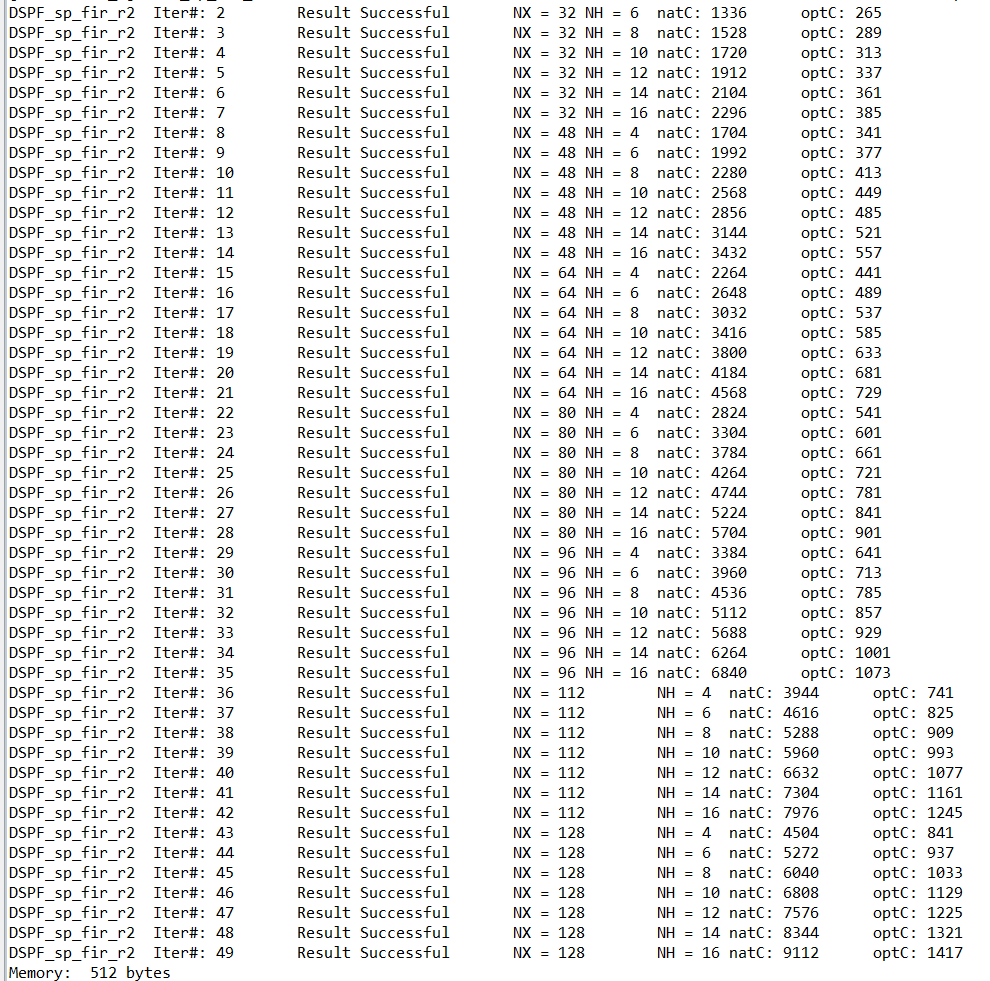
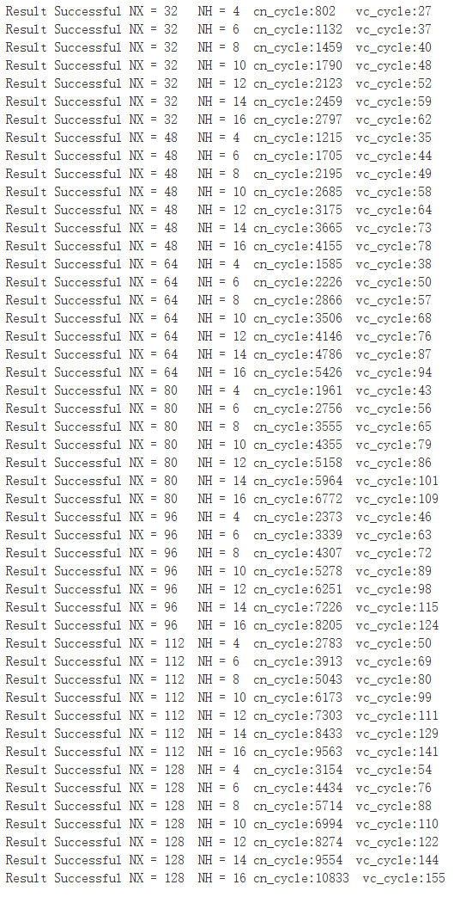

```c
void DSPF_sp_fir_r2(
    vector float *x,   	//输入数组
    float *h,    	    //系数数组
    vector float *r,    //输出数组
    int nh,   //系数数组长度                
    int nr    //输出数组长度           
)
```
**函数说明**：
**计算**：r(n) = h(0)*x(n) + h(1)*x(n−1) + ... + h(nh−1)*x(n−nh+1)   where n = {0, 1, ... , nr−1}
**说明**：Ti中初始化x时前（nh-1）为0，表示计算公式中x的负数索引

**参数要求**：

 * h reverse order  
 * nr >= 2 && nr % 2 = 0
 * nh >=4 && nh % 2 = 0

**函数性能：**（单位：cycle）

|     规模      | TI优化 | FT向量C | FT线性汇编 | FT汇编 |
| :-----------: | :----: | :-----: | :--------: | :----: |
|  NX=32、NH=4  |  241   |   29    |            |   24   |
| NX=32、NH=16  |  385   |   65    |            |   28   |
|  NX=48、NH=4  |  341   |   37    |            |   27   |
| NX=48、NH=16  |  557   |   78    |            |   34   |
|  NX=64、NH=4  |  441   |   38    |            |   27   |
| NX=64、NH=16  |  729   |   94    |            |   34   |
|  NX=96、NH=4  |  641   |   46    |            |   30   |
| NX=96、NH=16  |  1073  |   124   |            |   40   |
| NX=128、NH=16 |  1417  |   155   |            |   46   |
|   平均优化    |   0    |   8.7   |            |  20.0  |

* TI：natC为原始C，optC为TI优化C 

  

* FT-M7002

  vector版本：

