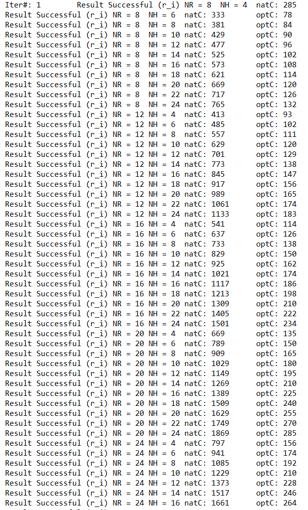
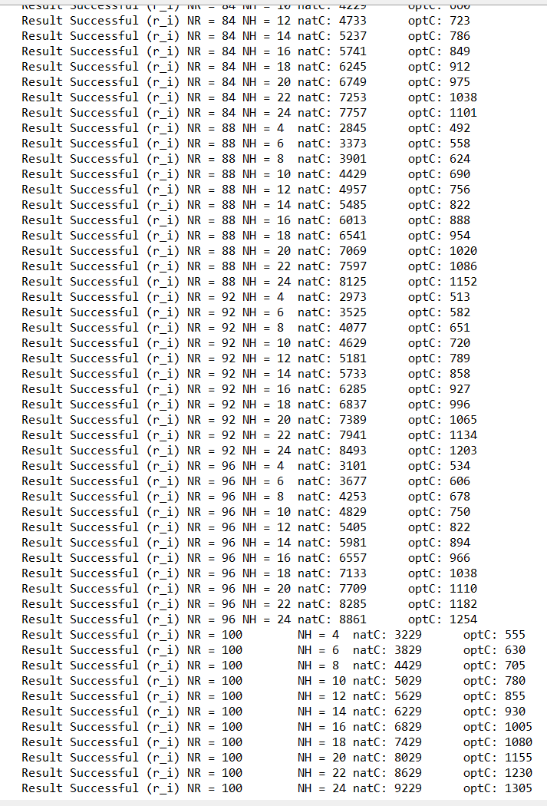
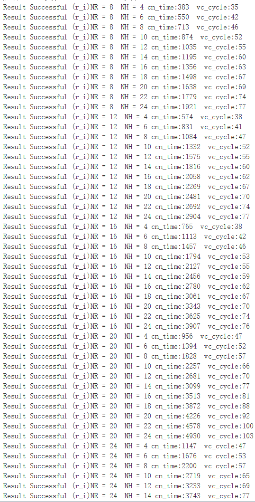
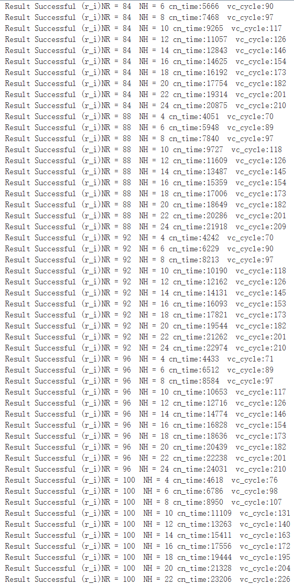

```c
void DSP_fir_cplx (
    vector signed short *x,   
    signed short *h,       
    vector signed short  *r, /*额外开了2*r的内存空间  减少在函数内部分配内存和初始化*/
    int nh,
    int nr
)
```
**函数介绍**：Q15格式的复数fir滤波器
**计算**：r(n) = h(0)*x(n) + h(1)*x(n−1) + ... + h(nh−1)*x(n−nh+1)   where n = {0, 1, ... , nr−1}

**参数要求**：  

 *  nr >= 8; nr % 4 == 0 
 * nh >= 4; nh % 2 == 0 
 * r 16字对齐

**函数性能：**（单位：cycle）

|     规模      | TI优化 | FT向量C | FT线性汇编 | FT汇编 |
| :-----------: | :----: | :-----: | :--------: | :----: |
|  NX=16、NH=4  |  102   |   35    |            |   12   |
| NX=16、NH=24  |  122   |   77    |            |   29   |
|  NX=32、NH=4  |  198   |   47    |            |   17   |
| NX=32、NH=24  |  438   |   103   |            |   43   |
|  NX=64、NH=4  |  366   |   58    |            |   23   |
| NX=64、NH=24  |  846   |   156   |            |   68   |
| NX=88、NH=24  |  1152  |   209   |            |   93   |
| NX=100、NH=4  |  555   |   76    |            |   32   |
| NX=100、NH=24 |  1305  |   237   |            |  105   |
|   平均优化    |   0    |  5.07   |            |   12   |

* TI：natC为原始C，optC为TI优化C 

  

  

* FT-M7002

  vector版本：VC1，vc2分别对应为vector_c目录下的verson1.c和verson2.c
  





手工汇编版本： 
