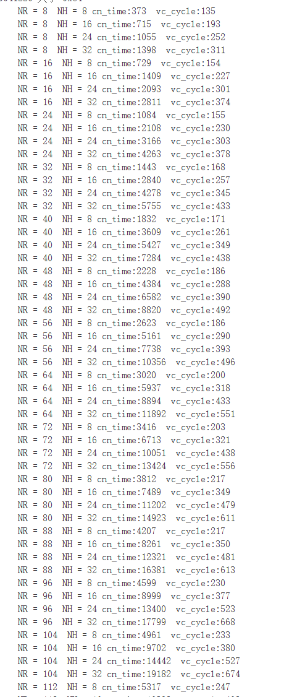

```c
void DSP_fir_r8_hM16_rM8A8X8(
    vector signed short *x,   
    signed short *h,       
    vector signed short  *r, /*额外开了2*r的内存空间  减少在函数内部分配内存和初始化*/
    int nh,
    int nr
)
```
**函数介绍**：Q15格式的复数fir滤波器
**计算**：r(n) = h(0)*x(n) + h(1)*x(n−1) + ... + h(nh−1)*x(n−nh+1)   where n = {0, 1, ... , nr−1}

**参数要求**：  

 *  nr >= 8; nr % 8 == 0 
 * nh >= 8; nh % 8 == 0 
 * 

**函数性能：**（单位：cycle）

|     规模      | TI优化 | FT向量C | FT线性汇编 | FT汇编 |
| :-----------: | :----: | :-----: | :--------: | :----: |
|  NX=8、NH=8   |   96   |   135   |            |        |
|  NX=8、NH=32  |  110   |   311   |            |        |
|  NX=32、NH=8  |  168   |   231   |            |        |
| NX=32、NH=32  |  433   |   287   |            |        |
|  NX=64、NH=8  |  411   |   200   |            |        |
| NX=64、NH=32  |  523   |   551   |            |        |
|  NX=88、NH=8  |  501   |   217   |            |        |
| NX=128、NH=8  |  771   |   261   |            |        |
| NX=128、NH=32 |  995   |   786   |            |        |

* TI：natC为原始C，optC为TI优化C 

  

* FT-M7002

  vector版本：VC1，vc2分别对应为vector_c目录下的verson1.c和verson2.c
  



手工汇编版本： 