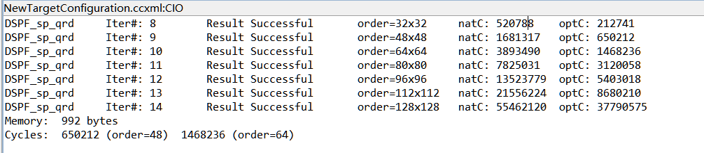
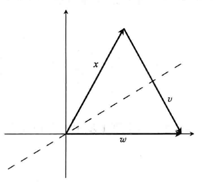
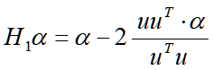
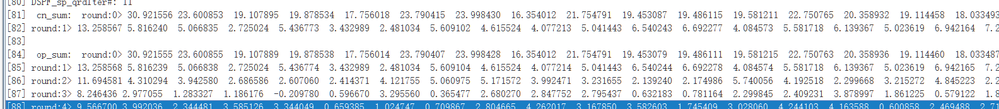
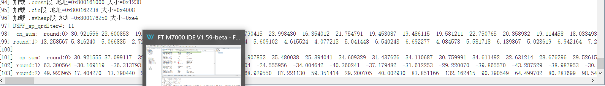
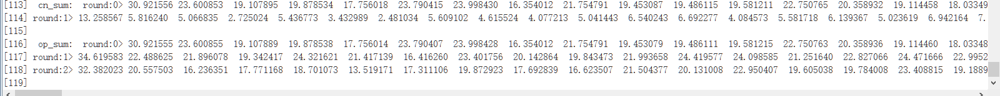
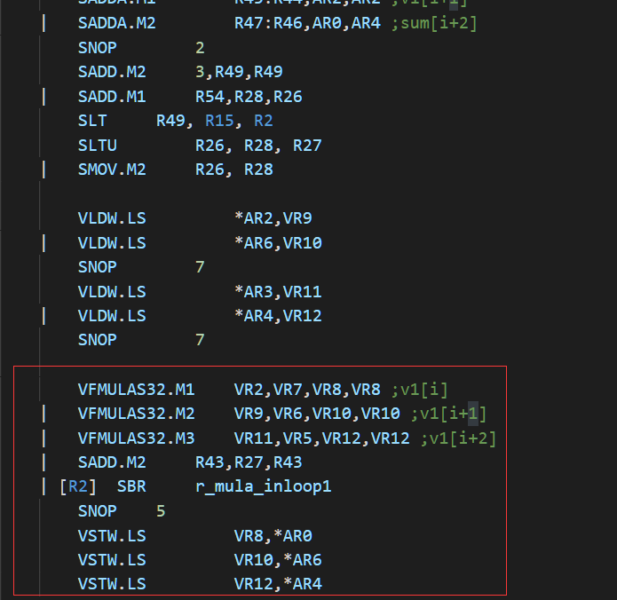
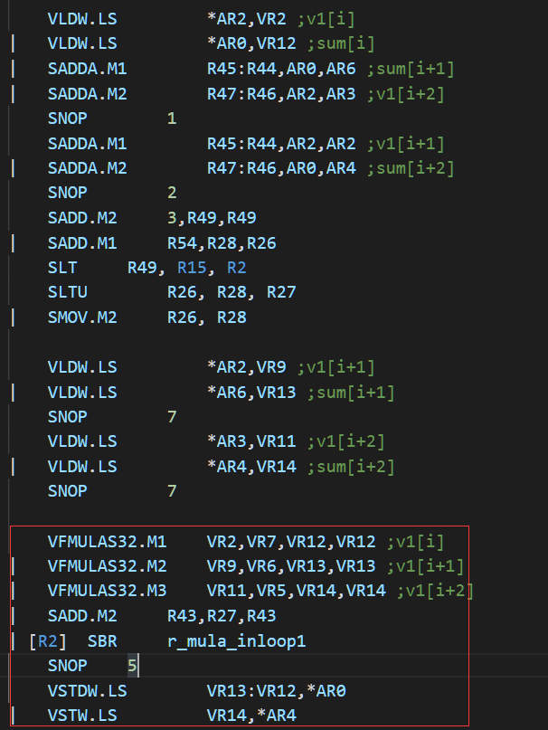

# QR分解优化
建议后续学习的同学参考“QR”文件夹中的QR分解工程，先自己实现简单的对应的复数或双精度的向量C。version中的版本可不参考。
交付代码也以“QR”文件夹中的代码为准。

TI优化-O2



## QR分解基本过程

A分解为正交矩阵Q和上三角矩阵R





其中保证x与w模长相等

ti对qr分解的代码实现如下

```c
int DSPF_sp_qrd_cn(const int Nrows, const int Ncols, float *A, float *Q,
                   float *R, float *u) {
  int row, col, i, k, loop_count;
  float alpha, scale, sum, norm_sqr;
 
  memcpy(R, A, sizeof(float) * Nrows * Ncols);
  memset(Q, 0.0, sizeof(float) * Nrows * Nrows);
  for (row = 0; row < Nrows; row++) {
    Q[row + row * Nrows] = 1.0;
  }

  if (Nrows <= Ncols) {
    loop_count = Nrows - 2;
  } else {
    loop_count = Ncols - 1;
  }
  for (col = 0; col <= loop_count; col++) {
    sum = 0;
      //计算第col列向量内积
    for (row = col; row < Nrows; row++) {
      sum += R[col + row * Ncols] * R[col + row * Ncols];
    }
    if (sum != 0) {
      alpha = sqrt(sum);
      if (R[col + col * Ncols] >= 0) {
        alpha = -alpha;
      }
      u[col] = R[col + col * Ncols] + alpha;
      R[col + col * Ncols] = -alpha；
      for (row = col + 1; row < Nrows; row++) {
        u[row] = R[col + row * Ncols];
        R[col + row * Ncols] = 0;
      }
      if (alpha * u[col] != 0.0) {
        scale = 1 / (alpha * u[col]);
        /* R=Q1*R */
        for (i = col + 1; i < Ncols; i++) {
          sum = 0;
          for (k = col; k < Nrows; k++) {
            sum += u[k] * R[i + k * Ncols];
          }
          sum *= scale;
          for (k = col; k < Nrows; k++) {
            R[i + k * Ncols] -= u[k] * sum;
          }
        }
        /* Q=A*Q1 */
        for (i = 0; i < Nrows; i++) {
          sum = 0;
          for (k = col; k < Nrows; k++) {
            sum += u[k] * Q[k + i * Nrows];
          }
          sum *= scale;
          for (k = col; k < Nrows; k++) {
            Q[k + i * Nrows] -= u[k] * sum;
          }
        }
      } /* if (norm_sqr!=0) */
    }   /* if (sum!=0) */
  }     /* for (col=0;col<=loop_count;col++) */
  return 0;
}

```


## 程序基本框架

1. 依据R的子矩阵的第一列计算得出u
2. 更新R的子矩阵的第一列
3. 依据u更新R的子矩阵
4. 依据u更新Q
5. 回到第一步

## 基本优化思想

- 将矩阵放在AM空间，尽量减少DDR和AM之间的数据交换。尽管许多操作变得更加复杂，但能有效减少数据传输的损耗。
- 不与16对齐的数据，使用开关vpe来处理。
- 使用vector float* 型指针到float*型指针的转化，以此来实现函数参数的传输，方便对不对齐16规模的矩阵的处理

```c
    part_op(vBlock_index);
    uv[0] = vec_muli(uv[0], vzero);
    uv[0] = vec_add(uv[0], v[0]);
  
    vtmp = vec_mula(v[0], v[0], vtmp);
    v[0] = vec_muli(v[0], vzero);
    mov_to_vlr(0xFFFF);
```

```c
 void update_uv_R(vector float *v, vector float *uv, int vBlock_index,
                 float alpha) {
  vector float vtmp;
  vtmp = vec_svbcast(alpha);
  part_op_uv(vBlock_index);

  // update uv u[col] = R[col + col * Ncols] + alpha
  uv[0] = vec_add(uv[0], vtmp);

  // update R   R[col + col * Ncols] = -alpha;
  v[0] = vec_sub(vtmp, v[0]);

  mov_to_vlr(0xFFFF);
}
```

- 对存储在AM空间的数据可以看作是向量矩阵，每个矩阵元素为一个向量

  其中vBlock_index为一个浮点数在一个向量中的位置，有以上信息便可以进行精确的操作
  
- 将DDR的矩阵A转置传输给AM中的r，方便存取和计算。FT芯片中AM中的数据是规定行优先顺序存取的，以此传入转置的A更方便对A的按列存取。

- 将r看作是向量矩阵，每一个矩阵元素是一个向量，vBlock_index为一个向量元素在向量中的位置下标

## 优化的版本

**总共实现了6个版本的优化**：

version1、version2仅针对16对齐的矩阵，对AM的向量的存取也是行优先每次连续存取。后面version4、5版本在存取上有了新的方式，即vector float* 型指针到float*型指针的转化。

##### version1：

向量化的基础上，简单的循环展开。即对满足条件的，每3个向量作为一个循环来处理。
| 规模  |  32x32  |  48x48  |   64x64   |   80x80   |   96x96   |  112x112  |  128x128   |  144x144   |
| :---: | :-----: | :-----: | :-------: | :-------: | :-------: | :-------: | :--------: | :--------: |
| TI-op | 212,741 | 650,212 | 1,468,236 | 3,120,058 | 5,403,018 | 8,680,210 | 37,790,575 | 18,448,677 |
| v1-op | 173,369 | 394,452 |  703,377  | 1,107,906 | 1,611,168 | 2,207,513 | 2,908,326  | 3,716,324  |

##### version2：

在version1的基础上，进一步展开。update_qr中外循环每6行一展开，内循环每3个向量一展开处理。此时发现O2优化的问题，要给vector float临时变量添加volatile关键字声明。
对代码进行重构，类似于矩阵乘法，一次对6*48规模的矩阵进行计算。同时进行循环展开,计算访存解耦。在实现中矩阵计算并没有数据依赖，但编译后，三个MAC单元的并行工作效果并不好。

运行结果也不是特别好，由于加了volatile关键字，导致存取指令过多，严重影响运行效率

| 规模  |  32x32  |  48x48  |   64x64   |   80x80   |   96x96   |  112x112  |  128x128   |  144x144   |
| :---: | :-----: | :-----: | :-------: | :-------: | :-------: | :-------: | :--------: | :--------: |
| TI-op | 212,741 | 650,212 | 1,468,236 | 3,120,058 | 5,403,018 | 8,680,210 | 37,790,575 | 18,448,677 |
| v1-op | 215,958 | 492,625 |  866,509  | 1,396,638 | 2,057,438 | 2,793,203 | 2,439,685  | 4,804,674  |

##### version3：

在version2的基础上，使之适应任意参数，仅需修改 DSPF_sp_qrd函数中的一行代码： int Nvecs = (Nrows+15) / 16。缺点就是在调用DSPF_sp_qrd前需要手动补零对齐16传入q矩阵和r矩阵。所以运行时间与version2大同小异。没有必要再次比较。

##### version4：

改善version3的缺点，灵活使用指针，使用户不用补齐矩阵，方便处理任意规模矩阵。函数part_op也做出对应的修改。旧的part_op变为vBlock_index之前的vpe都关掉，新的part_op变为只操作size大小的vpe。由于使用了指针转化，part_op_uv也不在需要。原本part_op_uv需要在update_uv_R中使用，但现在使用了指针，每次更新的都是数组的第一个元素，所以每次固定仅需开vpe0，即mov_to_vlr(0x0001)。

| 规模  |  32x32  |  48x48  |   64x64   |   80x80   |   96x96   |  112x112  |  128x128   |  144x144   |
| :---: | :-----: | :-----: | :-------: | :-------: | :-------: | :-------: | :--------: | :--------: |
| TI-op | 212,741 | 650,212 | 1,468,236 | 3,120,058 | 5,403,018 | 8,680,210 | 37,790,575 | 18,448,677 |
| v4-op | 153,407 | 345,893 |  625,340  |  993,613  | 1,454,378 | 2,019,598 | 2,689,337  | 3,463,729  |

##### version5：

改进version4中part_op的开关vpe操作，旧的part_op使用了switch来判断开关vpe的具体操作，但逻辑判断速度慢且冗余。可直接使用移位操作shift=0xffff>>shift;  mov_to_vlr(shift); 完成vpe的开关 shift为提前计算好的0xffff需要移位的位数。
| 规模  |  32x32  |  48x48  |   64x64   |   80x80   |   96x96   |  112x112  |  128x128   |  144x144   |
| :---: | :-----: | :-----: | :-------: | :-------: | :-------: | :-------: | :--------: | :--------: |
| TI-op | 212,741 | 650,212 | 1,468,236 | 3,120,058 | 5,403,018 | 8,680,210 | 37,790,575 | 18,448,677 |
| v5-op | 147,217 | 336,639 |  598,492  |  954,128  | 1,409,395 | 1,930,361 | 2,592,082  | 3,359,199  |

##### version6:

所有操作每三个向量一展开，以便获取O2优化后的汇编代码，在此基础上编写汇编

##### version7：

修改参数，不传A的转置矩阵。

norm2函数计算模长的方式改变，只开一个vpe

对r按行更新

##### version8:

在version7的基础上循环展开

## version_unroll

前面的版本虽然com_norm_sqr和v_mul_sub内部进行了循环展开，但访存次数过多，影响效率。

观察可知，以下代码中存在大量重复访存，课将R和Q的计算合并，以减少对uv和q、r的重复访存。并手动全展开。

但该版本并不好，程序过于复杂，过于冗余，对不同规模矩阵的判断过多，不采用。

```c
		/* R=Q1*R */
		for (i = col + 1; i < Ncols; i++) {
          sum = com_norm_sqr(&r[i * Nvecs + Ri], &uv[Ri], Nvecs - Ri,
                             vBlock_index);
          sum *= scale;
          v_mul_sub(&r[i * Nvecs + Ri], &uv[Ri], sum, Nvecs - Ri, vBlock_index);
        }
        /* Q=A*Q1 */
        for (i = 0; i < Nrows; i++) {
          sum = com_norm_sqr(&q[i * Nvecs + Ri], &uv[Ri], Nvecs - Ri,
                             vBlock_index);
          sum *= scale;
          v_mul_sub(&q[i * Nvecs + Ri], &uv[Ri], sum, Nvecs - Ri, vBlock_index);
        }
```

|    规模    |  32x32  |  48x48  |   64x64   |   80x80   |   96x96   |  112x112  |  128x128   |  144x144   |
| :--------: | :-----: | :-----: | :-------: | :-------: | :-------: | :-------: | :--------: | :--------: |
|   TI-op    | 212,741 | 650,212 | 1,468,236 | 3,120,058 | 5,403,018 | 8,680,210 | 37,790,575 | 18,448,677 |
| vunroll-op | 107,272 | 246,996 |  436,242  |  684,618  |  989,111  | 1,396,163 | 1,872,157  | 2,419,125  |


综合对比

| 规模  |  32x32  |  48x48  |   64x64   |   80x80   |   96x96   |  112x112  |  128x128   |  144x144   |
| :---: | :-----: | :-----: | :-------: | :-------: | :-------: | :-------: | :--------: | :--------: |
| TI-op | 212,741 | 650,212 | 1,468,236 | 3,120,058 | 5,403,018 | 8,680,210 | 37,790,575 | 18,448,677 |
| v1-op | 173,369 | 394,452 |  703,377  | 1,107,906 | 1,611,168 | 2,207,513 | 2,908,326  | 3,716,324  |
| v2-op | 215,958 | 492,625 |  866,509  | 1,396,638 | 2,057,438 | 2,793,203 | 2,439,685  | 4,804,674  |
| v4-op | 153,407 | 345,893 |  625,340  |  993,613  | 1,454,378 | 2,019,598 | 2,689,337  | 3,463,729  |
| v5-op | 147,217 | 336,639 |  598,492  |  954,128  | 1,409,395 | 1,930,361 | 2,592,082  | 3,359,199  |
| v6-op | 112,361 | 255,552 |  458,938  |  730,720  | 1,071,964 | 1,486,295 | 1,980,886  | 2,556,231  |
| v7-op | 106,978 | 241,494 |  436,004  |  696,770  | 1,024,828 | 1,422,528 | 1,902,021  | 2,460,606  |
| asm-op | 108,592 | 244,870 |  432,534  |  683,477  | 998,623 | 1,364,800 | 1,805,944 | 2,319,792 |


## 问题记录

数据规模96*96

```c
vector float *r = (vector float*)0x040000000;
vector float *q = (vector float*)0x040030000;
vector float *uv = (vector float*)0x040060000;
```
静态分配地址可行



当分配范围变化时，不可行

```c
vector float *r = (vector float*)0x040000000;
vector float *q = (vector float*)0x040040000;
vector float *uv = (vector float*)0x040080000;
```


使用动态分配时，出错

```c
     vector float *r = (vector float *)vmalloc((num + 16) * 4);
     vector float *q = (vector float *)vmalloc(Nrows * Nrows * 4 );
     vector float *uv = (vector float *)vmalloc((Nrows + 16) * 4);
```



汇编问题

以下是问题代码



在仔细调试后，会发现 每次SBR指令执行后，其下的存数指令只有VR8存数成功，VR10，VR12均没有执行。问题在于本人对SBR之后的指令如何执行不太了解。但不管如何，SBR后可最少执行一条ST命令

修改如下


